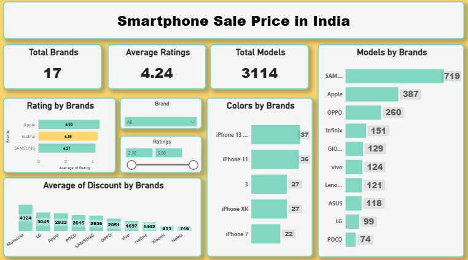

# 📱 Smartphone Sale Price in India Dashboard
***Overview:***
An interactive Power BI dashboard that analyzes smartphone sales/pricing data in India. It helps users explore brands, ratings, models, colors, and discounts to understand market trends and compare smartphone brands effectively.

It answers key questions such as:

1.Which brands have the most models available?

2.What is the overall average rating across smartphones?

3.Which brands have the highest average ratings?

4.Which brands offer higher average discounts?

5.What are the most common colors across brands?

# 🎯 Objectives
The dashboard aims to:

1.Monitor smartphone market availability by brand

2.Compare brand performance using ratings

3.Analyze model distribution across brands

4.Identify discount trends brand-wise

5.Support data-driven decisions for buyers/sellers

# 🛠️ Tools & Technologies
📊 Power BI Desktop — Dashboard creation & visualization 

📂 Power Query — Data cleaning & transformation

🧠 DAX — Measures & KPIs

📁 Dataset (Excel/CSV) — Source data for analysis

🧩 Data Modeling — Relationships & reporting structure

# 📂 Dataset Description
The dataset contains smartphone-related attributes such as:

🏷 Brand | 📱 Model | ⭐ Rating | 🎨 Color | 💰 Sale Price / MRP | 🧾 Discount

This enables comparison of market presence, ratings, and discount strategies across brands.

# 📊 Dashboard Features

***Key Performance Indicators (KPIs)***
Provides a quick market snapshot:

i. Total Brands: 17

ii. Average Ratings: 4.24

iii. Total Models: 3114

➡ Helps understand overall dataset coverage instantly.

***Models by Brands***
i. Visualization: Bar chart

ii. Shows brand-wise model count

iii. Identifies brands with highest market availability

***Rating by Brands***

i. Visualization: Bar chart

ii. Compares average ratings by brand

iii. Highlights top-rated brands

***Colors by Brands**

i. Visualization: Bar chart

ii. Shows color availability by brand/models

iii. Helps identify common color trends in the market

***Average of Discount by Brands**

i. Visualization: Column chart

ii. Compares average discount across brands

iii. Finds brands offering better deals on average

***Interactive Filters**

Dynamic filtering by:

i. Brand

ii. Ratings range

➡ Enables deeper brand-level exploration and comparison.

# 💡 Key Insights
i. A few brands dominate the market with the highest number of models
ii. Ratings help identify quality perception by brand
iii. Discount comparison highlights value-for-money brands
iv. Color distribution shows customer preference and product variety
v. Filters make the dashboard interactive for quick exploration

# 📷 Dashboard Preview

